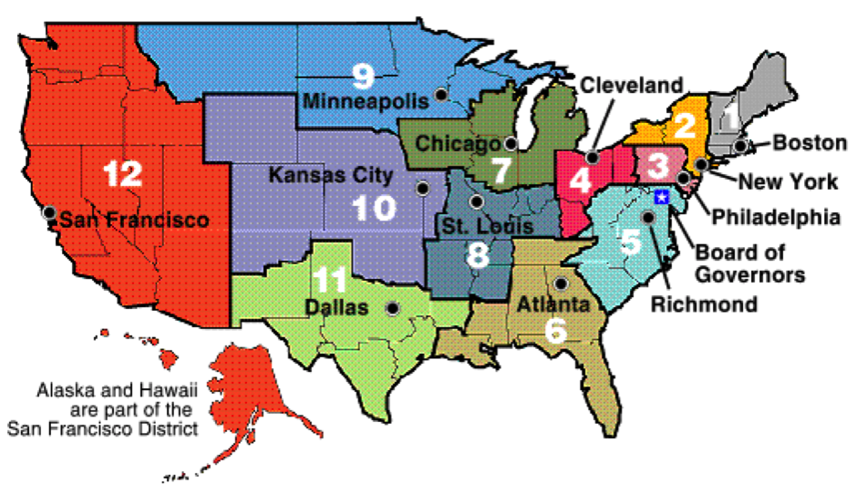
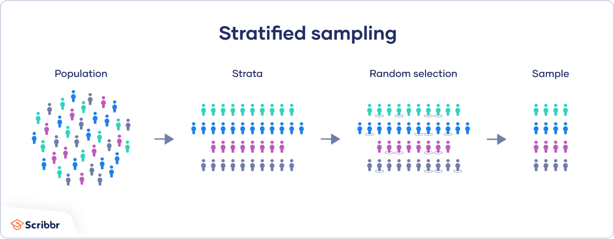
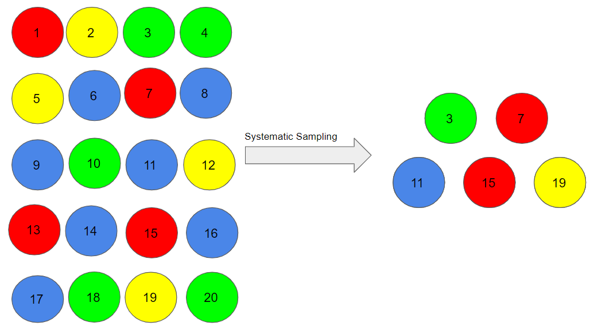
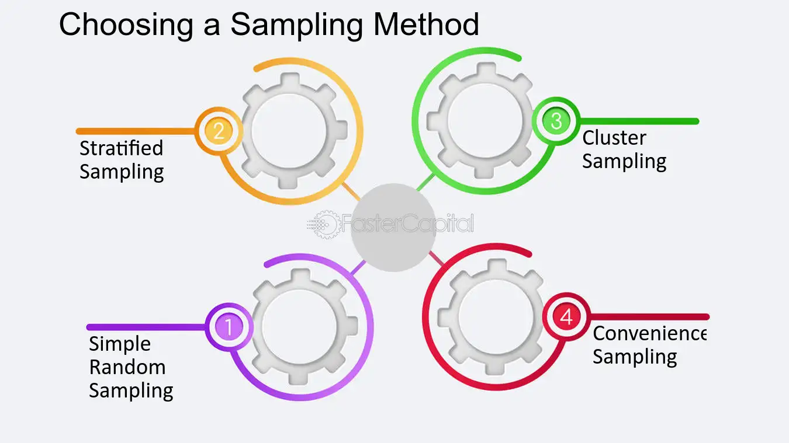
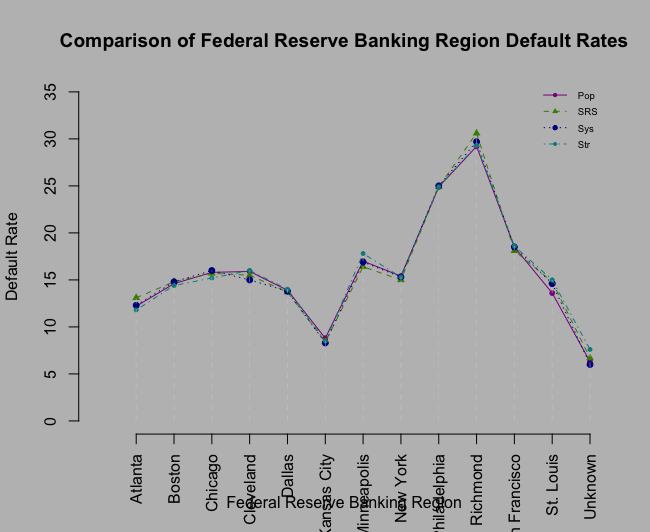

```{r setup, include=FALSE}
options(htmltools.dir.version = FALSE)
if (!require("knitr")) {
   install.packages("knitr")
   library(knitr)
}
if (!require("pander")) {
   install.packages("pander")
   library(pander)
}
if (!require("plotly")) {
   install.packages("plotly")
   library(plotly)
}
if (!require("ggplot2")) {
   install.packages("ggplot2")
   library(ggplot2)
}
if (!require("xaringanthemer")) {
   install.packages("xaringanthemer")
   library(xaringanthemer)
}
knitr::opts_chunk$set(
                  fig.width=3, 
                  fig.height=3, 
                  fig.retina=12,
                  out.width = "100%",
                  cache = FALSE,
                  echo = TRUE,
                  message = FALSE, 
                  warning = FALSE,
                  hiline = TRUE
                  )
```


name:toc
class:inverse8, top
background-color: white

<h1 align="center"> Table of Contents </h1>
<BR>
<table align="center", width = "50%">
<tr>
<td style="text-size:50px; line-height: 1.5; font-variant:small-caps">

<font size = 6><b> Introduction </b></font> <br>
  
<font size = 6><b> Exploratory Data Analysis </b></font> <br>

<font size = 6><b> Overview of Sampling Plans </b></font> <br>
 
<font size = 6><b> Sampling Results </b></font> <br>

<font size = 6><b> Comparison of Sampling Results </b></font> <br>

<font size = 6><b> Recommendation </b></font> <br>

</td>
</tr>
</table>

---

class:inverse middle center
name: Introduction

<h1 align="center"> Introduction </h1>

<font size = 5>This data set is from banks that received loan applications from small businesses with a partial warranty from the Small Business Association (SBA). The data set contains 899,164 observations and 27 variables. 

Samples will be taken from this data set by testing simple random, stratified, clustered, and systematic sampling plans.

We will provide a recommendation on which sampling plan of the four is best according to cost and efficiency

---

class:inverse middle center
name: Exploratory Data Analysis

<h1 align="center"> Exploratory Data Analysis </h1>
<font size = 5>
The MIS_Status variable had all missing values removed

Regions variable created from the State variable according to the Federal Banking Regions 

Commas, periods, and dollar signs were removed from DisbursementGross, BalanceGross, ChgOffPrinGr, GrAppv, and SBA_Appv variables

Regions variable will be used for stratification

<div style="text-align: middle;">
  
</div>

---
class:inverse middle center
name:Transition

<h1 align="center"> Sampling Plan Overview </h1>


---
class:inverse middle center
name:sampling plan overview

<h1 align = "center">Simple Random Sample</h1>
<font size = 5>
A simple random sample is created by assigning an ID to all members if the population and randomly selecting a proportion of that population

Free from bias, but needs large sample size to ensure validity of sample results

<div style="text-align: middle;">
  
</div>


---

class:inverse middle center
name:sampling plan overview

<h1 align = "center">Stratified Sample</h1>
<font size = 5>

The whole population is divided into homogeneous groups with respect to an identifying characteristic

Each strata (group) is randomly sampled from 

<div style="text-align: middle;">
  
</div>

---

class:inverse middle center
name:sampling plan overview
<font size = 5>

<h1 align = "center">Systematic Sample</h1>

Number entire population, similar to simple random sample

Select units for the sample in a pattern, such as every nth number

<div style="text-align: middle;">
  
</div>


---

class:inverse middle center
name:sampling plan overview
<font size = 5>

<h1 align = "center">Sampling Process</h1>

The population of interest is defined to be SBA loan applicants in the United States

For the stratified sampling methods, Federal Bank Region will be used as the stratification variable

Approximately 10% proportions of each sub-population were used for the samples

All three previously mentioned sampling methods will be tested

<div style="text-align: middle;">
  
</div>


---

class:inverse middle center
name:Transition

<h1 align="center"> Sampling Results </h1>


---
class:inverse middle center
name:sampling results
<h1 style="font-size: 40px; color: white; font-weight: bold;">Simple Random Sample Results</h1>
    <table border="1"> <!-- Add border="1" to display borders -->
        <tr>
            <th>Region</th>
            <th>Status Unknown</th>
            <th>Defaulted</th>
            <th>Paid in Full</th>
            <th>Default Rate</th>
            <th>Sample Size</th>
            <th>Population Size</th>
        </tr>
        <tr>
            <td>Atlanta</td>
            <td>1</td>
            <td>731</td>
            <td>4,856</td>
            <td>13.1</td>
            <td>5,588</td>
            <td>56,380</td>
        </tr>
        <tr>
            <td>Boston</td>
            <td>130</td>
            <td>1,211</td>
            <td>6,593</td>
            <td>14.8</td>
            <td>7,934</td>
            <td>84,451</td>
        </tr>
        <tr>
            <td>Chicago</td>
            <td>11</td>
            <td>2,244</td>
            <td>12,045</td>
            <td>15.7</td>
            <td>14,300</td>
            <td>141,003</td>
        </tr>
        <tr>
            <td>Cleveland</td>
            <td>2</td>
            <td>920</td>
            <td>4,999</td>
            <td>15.5</td>
            <td>5,921</td>
            <td>58,461</td>
        </tr>
        <tr>
            <td>Dallas</td>
            <td>0</td>
            <td>664</td>
            <td>4,177</td>
            <td>13.7</td>
            <td>4,821</td>
            <td>47,790</td>
        </tr>
        <tr>
            <td>Kansas City</td>
            <td>2</td>
            <td>332</td>
            <td>3,641</td>
            <td>8.4</td>
            <td>3,975</td>
            <td>38,711</td>
        </tr>
        <tr>
            <td>Minneapolis</td>
            <td>3</td>
            <td>927</td>
            <td>4,712</td>
            <td>16.4</td>
            <td>5,642</td>
            <td>56,208</td>
        </tr>
        <tr>
            <td>New York</td>
            <td>3</td>
            <td>723</td>
            <td>4,110</td>
            <td>15</td>
            <td>4,836</td>
            <td>49,028</td>
        </tr>
        <tr>
            <td>Philadelphia</td>
            <td>8</td>
            <td>3,207</td>
            <td>9,659</td>
            <td>24.9</td>
            <td>12,874</td>
            <td>128,604</td>
        </tr>
        <tr>
            <td>Richmond</td>
            <td>7</td>
            <td>1,247</td>
            <td>2,830</td>
            <td>30.6</td>
            <td>4,084</td>
            <td>42,028</td>
        </tr>
        <tr>
            <td>San Francisco</td>
            <td>9</td>
            <td>3,331</td>
            <td>15,072</td>
            <td>18.1</td>
            <td>18,412</td>
            <td>184,066</td>
        </tr>
        <tr>
            <td>St. Louis</td>
            <td>1</td>
            <td>157</td>
            <td>903</td>
            <td>13.1</td>
            <td>1,061</td>
            <td>10,704</td>
        </tr>
        <tr>
            <td>Unknown</td>
            <td>9</td>
            <td>11</td>
            <td>152</td>
            <td>6.7</td>
            <td>172</td>
            <td>1,730</td>
        </tr>
        <!-- You can add more rows and columns as needed -->
    </table>
---
class:inverse middle center
name:sampling results
<h1 style="font-size: 40px; color: white; font-weight: bold;">Systematic Sample Results</h1>
    <table border="1"> <!-- Add border="1" to display borders -->
        <tr>
            <th>Region</th>
            <th>Status Unknown</th>
            <th>Defaulted</th>
            <th>Paid in Full</th>
            <th>Default Rate</th>
            <th>Sample Size</th>
            <th>Population Size</th>
        </tr>
        <tr>
            <td>Atlanta</td>
            <td>5</td>
            <td>760</td>
            <td>5,426</td>
            <td>12.3</td>
            <td>6,191</td>
            <td>56,380</td>
        </tr>
        <tr>
            <td>Boston</td>
            <td>146</td>
            <td>1,391</td>
            <td>7,981</td>
            <td>14.8</td>
            <td>9,518</td>
            <td>84,451</td>
        </tr>
        <tr>
            <td>Chicago</td>
            <td>13</td>
            <td>2,499</td>
            <td>13,137</td>
            <td>16</td>
            <td>15,649</td>
            <td>141,003</td>
        </tr>
        <tr>
            <td>Cleveland</td>
            <td>2</td>
            <td>989</td>
            <td>5,609</td>
            <td>15</td>
            <td>6,600</td>
            <td>58,461</td>
        </tr>
        <tr>
            <td>Dallas</td>
            <td>2</td>
            <td>737</td>
            <td>4,589</td>
            <td>13.8</td>
            <td>5,328</td>
            <td>47,790</td>
        </tr>
        <tr>
            <td>Kansas City</td>
            <td>3</td>
            <td>354</td>
            <td>3,906</td>
            <td>8.3</td>
            <td>4,263</td>
            <td>38,711</td>
        </tr>
        <tr>
            <td>Minneapolis</td>
            <td>7</td>
            <td>1,027</td>
            <td>5,058</td>
            <td>16.9</td>
            <td>6,092</td>
            <td>56,208</td>
        </tr>
        <tr>
            <td>New York</td>
            <td>3</td>
            <td>815</td>
            <td>4,517</td>
            <td>15.3</td>
            <td>5,335</td>
            <td>49,028</td>
        </tr>
        <tr>
            <td>Philadelphia</td>
            <td>8</td>
            <td>3,579</td>
            <td>10,765</td>
            <td>25</td>
            <td>14,352</td>
            <td>128,604</td>
        </tr>
        <tr>
            <td>Richmond</td>
            <td>3</td>
            <td>1,378</td>
            <td>3,261</td>
            <td>29.7</td>
            <td>4,642</td>
            <td>42,028</td>
        </tr>
        <tr>
            <td>San Francisco</td>
            <td>12</td>
            <td>3,810</td>
            <td>16,740</td>
            <td>18.5</td>
            <td>20,562</td>
            <td>184,066</td>
        </tr>
        <tr>
            <td>St. Louis</td>
            <td>2</td>
            <td>173</td>
            <td>1011</td>
            <td>14.6</td>
            <td>1,186</td>
            <td>10,704</td>
        </tr>
        <tr>
            <td>Unknown</td>
            <td>6</td>
            <td>11</td>
            <td>172</td>
            <td>6</td>
            <td>189</td>
            <td>1,730</td>
        </tr>
        <!-- You can add more rows and columns as needed -->
    </table>
---

class:inverse middle center
name:sampling results
<h1 style="font-size: 40px; color: white; font-weight: bold;">Stratified Sample Results</h1>
    <table border="1"> <!-- Add border="1" to display borders -->
        <tr>
            <th>Region</th>
            <th>Status Unknown</th>
            <th>Defaulted</th>
            <th>Paid in Full</th>
            <th>Default Rate</th>
            <th>Sample Size</th>
            <th>Population Size</th>
        </tr>
        <tr>
            <td>Atlanta</td>
            <td>7</td>
            <td>663</td>
            <td>4,968</td>
            <td>11.8</td>
            <td>5,638</td>
            <td>56,380</td>
        </tr>
        <tr>
            <td>Boston</td>
            <td>152</td>
            <td>1,198</td>
            <td>7,095</td>
            <td>14.4</td>
            <td>8,445</td>
            <td>84,451</td>
        </tr>
        <tr>
            <td>Chicago</td>
            <td>16</td>
            <td>2,145</td>
            <td>11,939</td>
            <td>15.7</td>
            <td>14,100</td>
            <td>141,003</td>
        </tr>
        <tr>
            <td>Cleveland</td>
            <td>2</td>
            <td>937</td>
            <td>4,907</td>
            <td>16</td>
            <td>5,846</td>
            <td>58,461</td>
        </tr>
        <tr>
            <td>Dallas</td>
            <td>3</td>
            <td>671</td>
            <td>4,105</td>
            <td>14</td>
            <td>4,779</td>
            <td>47,790</td>
        </tr>
        <tr>
            <td>Kansas City</td>
            <td>2</td>
            <td>328</td>
            <td>3,541</td>
            <td>8.5</td>
            <td>3,871</td>
            <td>38,711</td>
        </tr>
        <tr>
            <td>Minneapolis</td>
            <td>4</td>
            <td>1,001</td>
            <td>4,615</td>
            <td>17.8</td>
            <td>5,621</td>
            <td>56,208</td>
        </tr>
        <tr>
            <td>New York</td>
            <td>3</td>
            <td>751</td>
            <td>4,148</td>
            <td>15.3</td>
            <td>4,902</td>
            <td>49,028</td>
        </tr>
        <tr>
            <td>Philadelphia</td>
            <td>13</td>
            <td>3,197</td>
            <td>9,650</td>
            <td>24.9</td>
            <td>12,860</td>
            <td>128,604</td>
        </tr>
        <tr>
            <td>Richmond</td>
            <td>7</td>
            <td>1,229</td>
            <td>2,966</td>
            <td>29.6</td>
            <td>4,202</td>
            <td>42,028</td>
        </tr>
        <tr>
            <td>San Francisco</td>
            <td>12</td>
            <td>3,423</td>
            <td>14,971</td>
            <td>18.6</td>
            <td>18,412</td>
            <td>184,066</td>
        </tr>
        <tr>
            <td>St. Louis</td>
            <td>4</td>
            <td>160</td>
            <td>906</td>
            <td>15</td>
            <td>1,070</td>
            <td>10,704</td>
        </tr>
        <tr>
            <td>Unknown</td>
            <td>3</td>
            <td>13</td>
            <td>157</td>
            <td>7.6</td>
            <td>173</td>
            <td>1,730</td>
        </tr>
        <!-- You can add more rows and columns as needed -->
    </table>
---

class:inverse middle center
name:sampling results

<h1 style="font-size: 40px;" align = "center">Default Rate Comparison by Sampling Strategy</h1>
<font size = 5>
  
<div style="text-align: middle;">
  
</div>

---

class:inverse middle center
name:sampling results

<h1 align = "center">Conclusions</h1>
<font size = 5>
  
Default rates maintain similar results across the different sampling strategies

A simple random sample is advantageous due to the large population size, also cheap and efficient

A stratified random sample is more time consuming to design and requires more information, but also would help to minimize unwanted bias

A systematic sample would be desirable in a smaller population size, but a simple random sample with this population size yields similar results

---

class:inverse middle center
name:sampling results

<h1 align = "center">Thank You</h1>

<h2 align = "center">Questions?</h2>

Slides created via the R packages:

[**xaringan**](https://github.com/yihui/xaringan)<br>
[gadenbuie/xaringanthemer](https://github.com/gadenbuie/xaringanthemer)

The chakra comes from [remark.js](https://remarkjs.com), [**knitr**](http://yihui.name/knitr), and [R Markdown](https://rmarkdown.rstudio.com).
